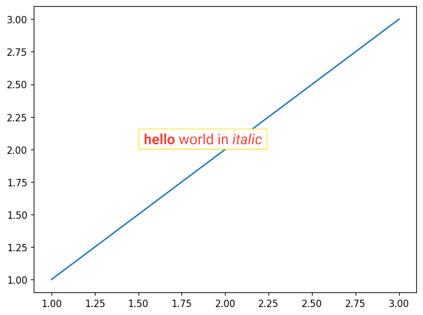
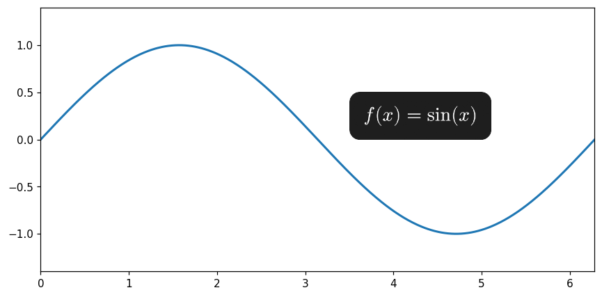

# mplty: Typst extension for matplotlib

> [!NOTE]
> Experimental project!!

<br>

## Quick start

```py
from mplty import ax_typst

fig, ax = plt.subplots()
ax.plot([1, 2, 3], [1, 2, 3])

typst_markup = r"""
#box(
  stroke: yellow,
  inset: 4pt,
  text(font: "Roboto", fill: red)[*hello* world in _italic_]
)
"""
ax_typst(1.5, 2, typst_markup)
```



<br>


## Installation

```
pip install git+https://github.com/y-sunflower/mplty.git
```

<br>

## Equation annotations

```py
import numpy as np
import matplotlib.pyplot as plt
from mplty import ax_typst

x = np.linspace(0, 2 * np.pi, 500)
y = np.sin(x)

fig, ax = plt.subplots(figsize=(8, 4))

ax.plot(x, y, lw=2)
ax.set_xlim(0, 2 * np.pi)
ax.set_ylim(-1.4, 1.4)

ax_typst(
    3.5,
    0,
    r"""
    #box(
      fill: rgb("#1e1e1e"),
      radius: 6pt,
      inset: 8pt,
      text(
        font: "New Computer Modern",
        fill: white,
        size: 11pt,
      )[
        $
          f(x) = sin(x)
        $
      ],
    )
    """,
    scale=1.2,
)
```

